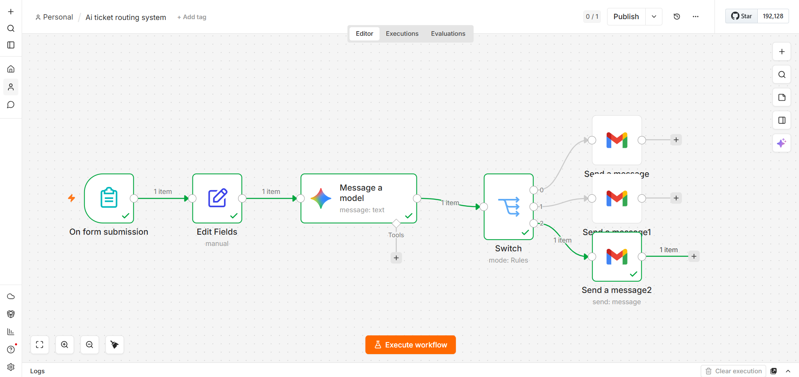

# 🚀 AI-Powered Customer Support Ticket Routing System

  
  
  

---

## 📌 Overview

An AI-powered automation system that classifies customer support tickets and routes them automatically to the correct department using **Google Gemini AI + n8n workflow automation + Gmail API**.

This system simulates real-world SaaS support infrastructure used in modern companies.

---

## 🎯 Problem Statement

Manual ticket handling leads to:
- Slow response time  
- Misrouting of issues  
- High workload on support teams  

### 💡 Solution
An automated AI system that:
- Understands customer issues
- Classifies tickets intelligently
- Routes them to correct teams instantly
- Sends structured email notifications

---

## ⚙️ System Architecture

Customer Form Submission → Gemini AI → Switch Node → Gmail Automation

---

## 📸 Workflow Diagram

---

## 🧠 AI Capabilities

- Ticket Classification:
  - Support
  - Engineering
  - Finance

- Priority Detection:
  - High / Medium / Low

- Sentiment Analysis:
  - Positive / Neutral / Negative

- Structured JSON Output for automation

---

## 🛠 Tech Stack

- n8n (Workflow Automation)
- Google Gemini API (AI Classification)
- Gmail API (Email Automation)
- JSON Parsing
- Switch-based Routing Logic

---

## 📧 Example

### Input:
"I was charged twice for my subscription"

### Output:
- Category: Finance  
- Department: Finance  
- Priority: High  
- Sentiment: Negative  

### Action:
Automatically sends email to Finance team with full ticket details

---

## 📊 Impact

- Reduced manual ticket handling time  
- Faster response workflow  
- Automated routing system  
- Real-world SaaS simulation  

---

## 🔥 Key Highlights

- Real-time AI decision making  
- Fully automated workflow  
- Scalable system design  
- Production-style automation logic  

---

## 🚀 Future Improvements

- Auto Ticket ID generation (TCK-0001)
- Google Sheets database logging
- Slack notifications for Engineering team
- SLA-based escalation system
- Auto-reply email to customers

---

## 🏁 Status

✔ Deployed using n8n  
✔ Active automation workflow  
✔ Production-ready prototype  

---

## 👨‍💻 Author

Built as part of AI Automation Learning Journey  
Focused on real-world workflow automation + AI systems design
